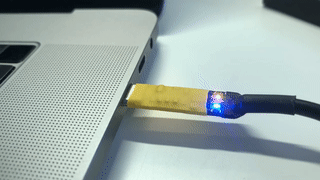
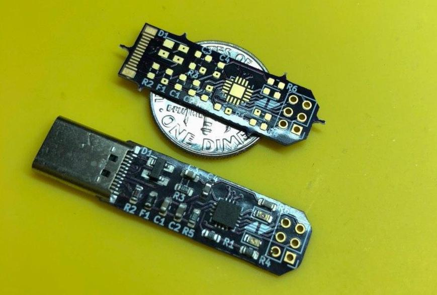

# Cereal

Compact, CP2102N based, USB-C to UART bridge.

## CP2102N Features

- USB 2.0 full-speed compatible
- Data transfer rates up to 3 Mbaud
- Low operating current: 9.5 mA
- Royalty-free Virtual COM port drivers

## Resources

- [Order board on Oshpark](https://oshpark.com/shared_projects/K6b0akiH)
- [Schematics](docs/schematics.pdf)
- [Gerber files](gergers)
- [BOM](docs/bom.csv)

## License

Licensed under either of

- Apache License, Version 2.0 ([LICENSE-APACHE](LICENSE-APACHE) or
  http://www.apache.org/licenses/LICENSE-2.0)
- MIT license ([LICENSE-MIT](LICENSE-MIT) or http://opensource.org/licenses/MIT)

at your option.

### Contribution

Unless you explicitly state otherwise, any contribution intentionally submitted
for inclusion in the work by you, as defined in the Apache-2.0 license, shall be
dual licensed as above, without any additional terms or conditions.